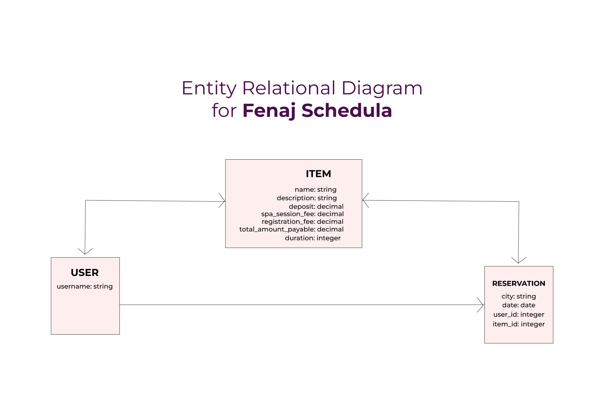

<a name="readme-top"></a>
# 🏥 Fenaj Schedula API <a name="about-project"></a>

> The Fenaj Schedula API allows users to create an account, book a new session and can reserve the session.


### Database Schema <a name="ER-diagram"></a>

<div align="center">
 
  <br/>
</div>                                       

### Frontend Repository
[Fenaj Schedula Front End](https://github.com/geekelo/fenaj-schedula)

## Project Kanban board:
[Kanban-board](https://github.com/users/geekelo/projects/3)

## 🛠 Built With <a name="built-with"></a>

  <ul>
    <li>Ruby</li>
    <li>Ruby on Rails</li>
    <li>Postgres SQL</li>
  </ul>

### Key Features <a name="key-features"></a>

- [x] Create a user based on the role
- [x] Create a session and view all sessions
- [x] Create reservations and view all reservations

## 💻 Getting Started <a name="getting-started"></a>

To get a local copy up and running, follow these steps.

### Prerequisites

In order to run this project you need:

- Command line or terminal
- IDE such as VsCode.
- Rails needs to be installed on your system.

### Setup

Clone this repository to your desired folder:
Example command:

```sh
  git clone git@github.com:geekelo/fenaj-schedula_API.git
```

### Install

Example command:

```sh
  cd fenaj-schedula_API
  bundle install (install all dependencies)
  rails db:create (to create database)
  rails db:migrate (to migrate tables)

```

### Usage

To run the project, run the following command:

```sh
 rails s -p 30001

```

<p align="right">(<a href="#readme-top">back to top</a>)</p>

<!-- AUTHORS -->

## 👥 Authors <a name="authors"></a>

👤 **Nasir Mahmood**

- GitHub: [Nasirkhan294](https://github.com/Nasirkhan294)
- LinkedIn: [nasirmahd](https://www.linkedin.com/in/nasirmahd/)

👤 **Eloghene Otiede**

- GitHub: [@geekelo](https://github.com/geekelo)
- LinkedIn: [eloghene-otiede](https://www.linkedin.com/in/eloghene-otiede-b146a3232/)
  
👤 **Fatima Najafi**

- GitHub: [@fatima-najafi](https://github.com/fatima-najafi)
- LinkedIn: [fatima-najafi](https://www.linkedin.com/in/fatima-najafi/)

👤 **Joyce Cruz**

- GitHub: [@balastar](https://github.com/balatstar)
- LinkedIn: [joyce-ann-cruz](https://www.linkedin.com/in/joyce-ann-cruz-668a41a7/)

👤 **Adeyemi Dada**

- GitHub: [@yemidada](https://github.com/yemidada)
- LinkedIn: [yemidada](https://www.linkedin.com/in/yemidada/)

<p align="right">(<a href="#readme-top">back to top</a>)</p>

## 🔭 Future Features <a name="future-features"></a>

- [] add comments
- [] add likes  
- [] error deduction for sessions

<!-- CONTRIBUTING -->

## 🤝 Contributing <a name="contributing"></a>

Contributions, issues, and feature requests are welcome!

Feel free to check the [issues page](../../issues/).

<p align="right">(<a href="#readme-top">back to top</a>)</p>

<!-- SUPPORT -->

## ⭐️ Show your support <a name="support"></a>

Please support this project and be a part of something meaningful and impactful. Your contribution can make a significant difference and help us achieve our goals faster.

<p align="right">(<a href="#readme-top">back to top</a>)</p>

<!-- ACKNOWLEDGEMENTS -->

## 🙏 Acknowledgments <a name="acknowledgements"></a>

I would like to express my sincere gratitude to [Murat Korkmaz](https://www.behance.net/gallery/26425031/Vespa-Responsive-Redesign) for this design and to all my Microverse partners who contributed to this project.

<p align="right">(<a href="#readme-top">back to top</a>)</p>

## :question: FAQ <a name="faq"></a>

- **Can I fork and reuse this repository?**

Absolutely! Please feel free to fork and reuse this repository for your own projects.

- **Is it okay to improve this repository? Will my changes be accepted?**

Definitely! We welcome any improvements or new ideas you may have. If your changes are good and align with the project's goals, we would be happy to accept them.


<p align="right">(<a href="#readme-top">back to top</a>)</p>

<!-- LICENSE -->

## 📝 License <a name="license"></a>

This project is [MIT](./LICENSE) licensed.

<p align="right">(<a href="#readme-top">back to top</a>)</p>